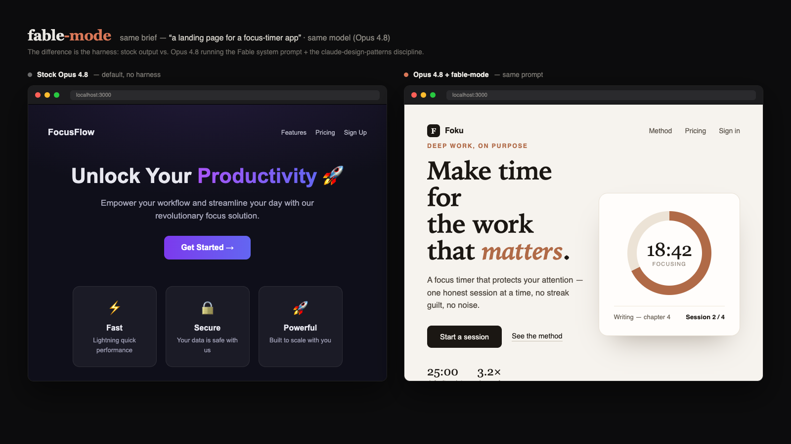

<div align="center">

# fable-mode

**Run Claude Fable 5 on Opus 4.8.**
The Mythos-class model the U.S. government pulled after three days — brought back as a system prompt.

 &nbsp;
 &nbsp;
 &nbsp;
 &nbsp;


One clone, one install: a native distillation of **how Fable 5 actually operates inside Claude Code** + a measured execution playbook + verification hooks + design and agent skills — wired into Claude Code. (The leaked consumer prompt lives on in `reference/`, but it's no longer what gets loaded — see below for why.)


<sub>Same brief, same model. Left: stock Opus 4.8. Right: Opus 4.8 in fable-mode.</sub>

</div>

---

## Why this exists

Claude Fable 5 shipped on June 9, 2026 as Anthropic's first Mythos-class model — and was suspended on June 12 under a U.S. export-control directive. You can't call the model right now.

But when its system prompt leaked, people noticed: a lot of what made Fable *feel* different — its taste, its directness, its tool-use instincts — lived in the prompt, not only the weights. Run that prompt on Opus 4.8 and the output changes character. The community calls it **Fable 5 Lite**.

There was a catch, though: the leaked prompt is Fable's *consumer chat* prompt. It governs claude.ai — artifacts, web-search etiquette, copyright limits, a Linux VM at `/mnt` — and almost none of that exists in Claude Code. Appending it to a terminal session spends ~42k tokens teaching the model rules for an environment it isn't in, some of which conflict outright with the Claude Code harness. Fable-in-Claude-Code runs on a *different* prompt entirely: outcome-first communication, autonomous-turn discipline, evidence-before-state-change, irreversibility-scaled reasoning.

So v2 replaces the leaked prompt with **`FABLE_CODE.md`** — an original distillation of that agentic layer, written against the real Claude Code Fable harness — plus the part no prompt can give you: measured discipline and verification, enforced by hooks.

## Quickstart

One installer, every OS — it's Python (already required by the hooks), so the same command works on Windows, macOS, and Linux:

```sh
git clone https://github.com/HalalifyMusic/fable-mode
cd fable-mode
python install.py        # Windows  (use python3 on macOS / Linux)
```

Then reload your shell and launch:

```sh
fable        # Opus 4.8 + FABLE_CODE.md + ultracode
```

Prefer a native one-liner? `./install.sh` (macOS / Linux) and `.\install.ps1` (Windows) just locate Python and run `install.py` for you.

**Reload after install:** `source ~/.zshrc` (or `~/.bashrc`) on Unix; `. $PROFILE` in PowerShell on Windows.

> **Requirements:** Python on PATH (`python --version`) for the hooks, and Claude Code installed for the `fable` launcher. On Windows, if `.\install.ps1` is blocked by execution policy, run `python install.py` directly (no policy needed).

The installer copies everything into `~/.claude`, adds the `fable` launcher (to your shell rc on Unix, to your PowerShell `$PROFILE` on Windows), and merges your settings (with a backup) — writing the absolute interpreter and hook paths so the hooks fire on every platform. Idempotent: safe to re-run. Needs Python ≥ 3.9 (the hooks are stdlib-only — no pip installs). No model switch, no API key — it runs on the Opus 4.8 you already have.

## Uninstall

```sh
python uninstall.py        # Windows  (python3 on macOS / Linux; or ./uninstall.sh, .\uninstall.ps1)
```

Removes the bundled files from `~/.claude`, strips the `fable` launcher line, and drops the two Fable hooks from `settings.json` (writing a fresh backup). It's surgical — your own skills, unrelated hooks, and `alwaysThinkingEnabled` are left untouched.

## What's in the bundle

- **`FABLE_CODE.md`** — the core. An original distillation of Fable 5's actual Claude Code operating layer: the final-message contract, outcome-first summaries, act-don't-ask autonomy, the report-vs-fix distinction, evidence-before-state-change, irreversibility-scaled reasoning, and the voice rules that genuinely transfer from the consumer prompt. This is what the launcher appends and the trigger hook injects.
- **`FABLE_PLAYBOOK.md`** — the measured layer. Fable-5 vs Opus-4-8 tool traces turned into rules: reasoning density (70% vs 47%), verify-after-edit, parallelism — plus an evidence-ledger grounding protocol. Original work, corrected in v2 against the harness itself (see the Fix 2 measurement caveat).
- **`reference/fable-system-consumer.md`** — the leaked Fable 5 *consumer* prompt, kept for reference and provenance only. Never installed, never injected.
- **Hooks** — `fable-trigger.py` injects `FABLE_CODE.md` once per session (always on, sized under Claude Code's 10k-char hook-output cap) and directs the model to read the full playbook on `xhigh`/`max`/`ultracode` or the phrase "use fable"; `test-after-edit.py` runs your project's tests after each edit and reports the result back — the one habit no model keeps on willpower.
- **`/ground` skill + `grounding-verifier` agent** — a self-terminating grounding loop and a cold verifier that assumes every claim is wrong until the live code proves it.
- **Skills** — `claude-design-patterns` (web-UI engineering), `webapp-testing`, `mcp-builder`, `skill-creator`, `explore-data`.
- **`fable` launcher** — Opus 4.8 + `FABLE_CODE.md` appended to the system prompt + `ultracode` effort (`fable.zsh` for Unix shells, `fable.ps1` for PowerShell).

## Pairs with loop-harness-system

[loop-harness-system](https://github.com/HalalifyMusic/loop-harness-system) is the execution-discipline layer to this repo's behavior layer: contract-first building, fresh-context evaluation, crash-resumable 3-file state. When it's installed (`~/.claude/docs/LOOP-HARNESS.md` exists), `fable-trigger.py` adds a one-line bridge to every session pointing the model at it — fable-mode governs how each role *thinks and writes*, the harness governs how work is *structured and judged*.

## The honest ceiling

This gives you Fable's *disposition*, not its raw capability. Reasoning depth, vision, long-horizon autonomy, and design intuition are weights-bound — only partly reachable by instruction. What transfers well: voice, formatting, grounding and verification, design patterns, effort configuration. On verification, parallelism, and communication it actually beats Fable, because those are enforced by hooks instead of left to intention.

## About the bundled pieces

- The leaked Fable 5 consumer prompt (`reference/fable-system-consumer.md`) is Anthropic's IP. It is already mirrored across high-star public repos; it's kept here for reference and provenance only — it is never installed or injected. Not ours to license, removable on request.
- `webapp-testing`, `mcp-builder`, `skill-creator` are from [anthropics/skills](https://github.com/anthropics/skills) (Apache-2.0); `explore-data` is from [anthropics/knowledge-work-plugins](https://github.com/anthropics/knowledge-work-plugins) (Apache-2.0).

## Credits

Made by HalalifyMusic — compiled from community sources (leaked prompts, public Anthropic skills) and original measurement and tooling work.

## Contributing

Issues and PRs welcome — see [CONTRIBUTING.md](CONTRIBUTING.md) for dev setup and conventions, [SECURITY.md](SECURITY.md) for the security model (the hooks run code on your machine), and [CHANGELOG.md](CHANGELOG.md) for the running history.

## License

MIT on the original code (see `LICENSE`). The bundled Fable system prompt and the Anthropic skills carry their own terms.
